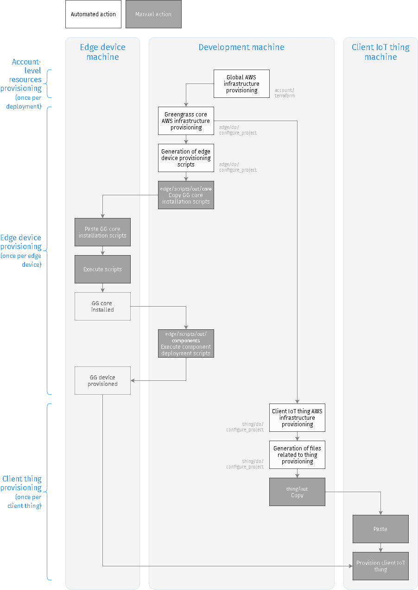

# Architecture overview

## Automation overview

The automation of cloud infrastructure operations is powered mostly by Terraform.

The automation of everyting else – including Terraform invocations – is powered by a bunch of very straightforward Python scripts called "do scripts". 

## "Do scripts"

The Python scripts that orchestrate all operations reside in directories named `do`. Despite being very simple, they manage to realize the semantics of a microscopic build system.

* Each Python script represents a step. Steps are similar to a "target" in a build system.
* A step is executed by running it from `/do.sh` or importing it from a different step.
* Importing step A from step B indicates a dependency between B and A, end ensures that A runs before B runs. So all the steps with all their imports form a logical dependency graph.
* One step may compute outputs that another step could use. Outputs are written to the module variables, and can be accessed by accessing `step.variable` after `import`ing `step`. Since importing a step executes the step, this ensures that the outputs of the step are ready before being read.
* Python only executes an imported module once, even though there may be many import directives. So it's fine to import a dependency from multiple steps. The dependency will be executed only once, but its results can be available to many other steps.

> *Q*: Why not use a full build system? 
>
> *A*: The amount of functionality is so small that bothering with something like `just`, `waf` or `bazel` felt like overkill. Especially when plain Python can do so much heavy lifting already.

## Configuration enforcement

*DosPesos* allows the user to configure the most important parameters of the solution, such as the names of the things and the AWS region. 

The goal of automation requires that the user specifies configuration values exactly once, and this configuration applies everywhere automatically. 

The configuration specified on a development machine must be respected in a variety of different contexts and inside different tools. For example, when running Terraform on the development machine, or when installing Greengrass core on a completely different machine (the edge device).

To solve this, *DosPesos* uses code generation from jinja2 templates. The template expansion is parametrized by the values specified in the configuration files. (Facts gathered during the preceding automation steps are also used as template parameters.) After the files – such as Terraform variables or installation scripts – are expanded, they can be used directly. The process of generating configuration-dependent files is called "setting up the working copy of the project". 

> *Q:*  Why not `cookiecutter` or `cruft`? 
>
> *A:* These tools are for generating completely new projects, not the configurations of working copies of the same project. In other words, I wanted to retain the checked out working copy as "git committable" as possible. Instead of generating a completely fresh project tree somewhere, during the configuration phase the current project tree is tweaked inline, and the expanded files are `.gitignore`'d. 

# Execution contexts

The project pertains to a number of execution contexts. It contains files that are executed on different machines on different stages for different purposes. The diagram below helps understand these stages.

>  *Note:* In DosPesos the process of edge device provisioning is well defined (installation of AWS Greengrass core). However, it doesn't care what client things are used with the core, so provisioning client things is out of scope. *DosPesos*, however, provides artifacts that allow to test the edge deployment by using clients from AWS IoT SDK samples.

# Resource diagram

The diagram below illustrates the AWS resources provisioned by the solution, and how they relate to stuff that's happening on the edge/thing machines. I drew it mostly for my own understanding, it's not necessary to use *DosPesos*.

